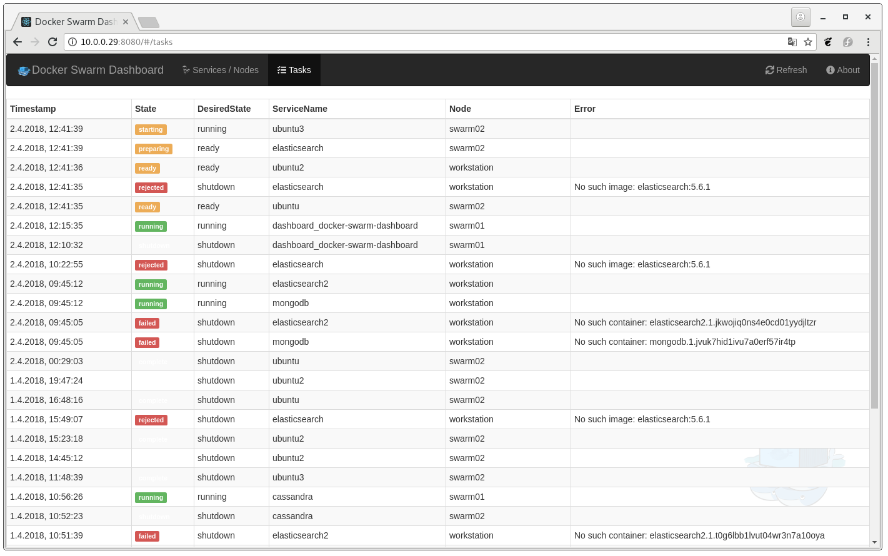

[](https://github.com/heckenmann/docker-swarm-dashboard/releases/latest)


[](https://github.com/heckenmann/docker-swarm-dashboard/actions/workflows/lint-server-src.yml)

# docker-swarm-dashboard
Dashboard for Docker Swarm Cluster

Docker-Image Size: < 25 MB

_Use a stable release in production, not the master-build!
Don't expose this service to the world! The endpoints offer the configuration of your services._

If you like this project, please give a ⭐ on github.
Feedback would be nice.

- [Tools](#tools)
- [Frameworks & Libraries](#frameworks--libraries)
- [Screenshots](#screenshots)
- [Getting started](#getting-started)
- [Development](#development)


## Tools
Special thanks to JetBrains for supporting this project with <a href="https://www.jetbrains.com/community/opensource/#support" target="_blank">Open Source development licenses</a>.

<a href="https://www.jetbrains.com/" target="_blank"></a>
                <a href="https://www.jetbrains.com/go/" target="_blank"></a>
                <a href="https://www.jetbrains.com/webstorm/" target="_blank"></a>


## Frameworks & Libraries
- [ApexCharts](https://apexcharts.com/)
- [Bootstrap](https://getbootstrap.com/)
- [Cypress](https://www.cypress.io/)
- [Fontawesome](https://fontawesome.com/)
- [Gorilla](https://www.gorillatoolkit.org/)
- [Jotai](https://jotai.org/)
- [React](https://reactjs.org/)


## Screenshots





## Getting started
### Tags
|Tag|Description|Image|
|---|---|---|
|e.g. 1.4.1|Stable release|ghcr.io/heckenmann/docker-swarm-dashboard:1.4.1|
|latest|Latest stable release|ghcr.io/heckenmann/docker-swarm-dashboard:latest|
|master|Current unstable master-build (not well tested)|ghcr.io/heckenmann/docker-swarm-dashboard:master|

### Configuration
Docker Swarm Dashboard supports environment variables for configuration.

| Environment variable | Description | Default |
|---|---|---|
| `DSD_HTTP_PORT` | HTTP port within the container. Usually does not need to be changed. | `8080` |
| `DSD_HANDLE_LOGS` | Set to `false` to prevent fetching and displaying logs. | `true` |
| `DSD_DASHBOARD_LAYOUT` | Default dashboard layout. Either `row` (default) or `column`. | `row` |
| `DSD_HIDE_SERVICE_STATES` | Comma-separated list of states to not show in the main dashboard. | (none) |
| `DSD_PATH_PREFIX` | Set a URL path prefix for the dashboard (e.g. `/dashboard`). Useful when running behind a reverse proxy or when the app should not be served from the root path. | `/` |
| `DSD_NODE_EXPORTER_LABEL` | Docker service label to identify node-exporter service for metrics collection. | `dsd.node-exporter` |
| `DSD_CADVISOR_LABEL` | Docker service label to identify cAdvisor service for container memory metrics. | `dsd.cadvisor` |
| `LOCALE` | Timestamp format based on a [BCP 47](https://www.rfc-editor.org/bcp/bcp47.txt) language tag. | (system) |
| `TZ` | [IANA Time zone](https://www.iana.org/time-zones) to display timestamps in. | (system) |
| `DSD_VERSION_CHECK_ENABLED` | When `true`, the system will check for updates and notify in the UI if a new version is available. | `false` |
| `DSD_WELCOME_MESSAGE` | If set, this message will be displayed to the user in a modal dialog when the web application is opened in the browser. | (none) |
| `DOCKER_API_VERSION` | Forces a specific Docker API version to use (e.g. `1.35`, `1.41`). When not specified, the server automatically negotiates the highest API version supported by both the client and Docker daemon. Only set this if you need to force a specific version for compatibility. | (auto-negotiated) |

### Pull Image from ghcr.io
```
docker pull ghcr.io/heckenmann/docker-swarm-dashboard:master
```

### docker-compose.yml
```
---
version: '3.5'

services:
  docker-swarm-dashboard:
    image: ghcr.io/heckenmann/docker-swarm-dashboard:master
    deploy:
      replicas: 1
      placement:
        constraints:
          - node.role == manager
    ports:
      - "8080:8080"
    volumes:
      - "/var/run/docker.sock:/var/run/docker.sock"
```

### docker-compose.yml with traefik and basic auth
This configuration sets a password for access. It is importand to configure ssl in traefik for better security.

In this example you can login with "**docker / docker**" on port 8080.

Have a look at https://doc.traefik.io/traefik/user-guides/docker-compose/acme-tls/
```
---
version: '3.5'

services:
  docker-swarm-dashboard:
    image: ghcr.io/heckenmann/docker-swarm-dashboard:master
    deploy:
      replicas: 1
      placement:
        constraints:
          - node.role == manager
      labels:
        - "traefik.enable=true"
        - "traefik.http.routers.dsd.entrypoints=web"
        - "traefik.http.routers.dsd.middlewares=basic-auth"
        - "traefik.http.services.dsd.loadbalancer.server.port=8080"
        - "traefik.http.routers.dsd.rule=PathPrefix(`/`)"
        # Login with docker / docker
        - "traefik.http.middlewares.basic-auth.basicauth.users=docker:$$2y$$10$$81nFbUw842iBd7MlngMR4.1VBI9j6Y.vTiamBAqtVNfs4qehzZB.e"
    volumes:
      - "/var/run/docker.sock:/var/run/docker.sock"

  traefik:
    image: "traefik:v2.9"
    deploy:
      placement:
        constraints:
          - node.role == manager
    command:
      #- "--log.level=debug"
      #- "--api.insecure=true"
      - "--providers.docker=true"
      - "--providers.docker.swarmMode=true"
      - "--providers.docker.exposedbydefault=false"
      - "--entrypoints.web.address=:8080"
    ports:
      - "8080:8080"
    volumes:
      - "/var/run/docker.sock:/var/run/docker.sock:ro"
```


### Deploy on docker-swarm
From the directory with docker-compose.yml run:
```
docker stack deploy --compose-file docker-compose.yml docker-swarm-dashboard
```

### Node Metrics (Optional)
Docker Swarm Dashboard can display node metrics from [Prometheus Node Exporter](https://github.com/prometheus/node_exporter).

#### Setup Node Exporter
Deploy `node-exporter` as a global service with the label `dsd.node-exporter` and attach it to the same overlay network as the dashboard. In this configuration the exporter is only reachable from other containers on the overlay network (recommended).

```yaml
node-exporter:
  image: prom/node-exporter:latest
  deploy:
    mode: global
    labels:
      - "dsd.node-exporter=true"
  networks:
    - your-network-name
  volumes:
    - /proc:/host/proc:ro
    - /sys:/host/sys:ro
    - /:/rootfs:ro
  command:
    - '--path.procfs=/host/proc'
    - '--path.sysfs=/host/sys'
    - '--collector.filesystem.mount-points-exclude=^/(sys|proc|dev|host|etc)($$|/)'


#### Customize Label
You can customize the label used to discover node-exporter by setting:
```yaml
environment:
  DSD_NODE_EXPORTER_LABEL: "my.custom.label"
```

### Service Memory Metrics with cAdvisor
Docker Swarm Dashboard can display service container memory metrics from [cAdvisor](https://github.com/google/cadvisor).

#### Setup cAdvisor
Deploy `cadvisor` as a global service with the label `dsd.cadvisor` and attach it to the same overlay network as the dashboard. In this configuration cAdvisor is only reachable from other containers on the overlay network (recommended).

```yaml
cadvisor:
  image: gcr.io/cadvisor/cadvisor:latest
  deploy:
    mode: global
    labels:
      - "dsd.cadvisor=true"
  networks:
    - your-network-name
  volumes:
    - /:/rootfs:ro
    - /var/run:/var/run:ro
    - /sys:/sys:ro
    - /var/lib/docker/:/var/lib/docker:ro
    - /dev/disk/:/dev/disk:ro
  command:
    - '--docker_only=true'
    - '--housekeeping_interval=30s'
```

#### Customize Label
You can customize the label used to discover cAdvisor by setting:
```yaml
environment:
  DSD_CADVISOR_LABEL: "my.custom.label"
```

#### What Metrics Are Displayed
The service metrics tab displays:
- **Total Memory Usage**: Aggregate memory usage across all containers in the service
- **Memory Limits**: Configured memory limits for each container
- **Per-Container Breakdown**: Memory usage for each task/container in the service
- **Usage Percentage**: Memory usage as a percentage of the configured limit

cAdvisor provides more detailed, per-container metrics compared to node-level metrics. This is particularly useful for:
- Identifying memory-hungry containers within a service
- Monitoring services approaching their memory limits
- Detecting potential out-of-memory (OOM) situations before they occur

### logs-generator (for testing)
```
docker service create --name logger chentex/random-logger:latest 50 200
```

## Development
### Local Build
```
docker build -t ghcr.io/heckenmann/docker-swarm-dashboard:local .
```

### Run api-mock-server
```
# from app-src
yarn run start-api-mock
```
### Run UI
```
# from app-src
yarn run start-dev-server
```
When you run the UI with the api-mock-server, you have to open the ui with "base"-param (API-URL):
http://localhost:3000#base="http%3A%2F%2Flocalhost%3A3001%2F"

### Run UI-tests
```
# from app-src
yarn run cy:run
```